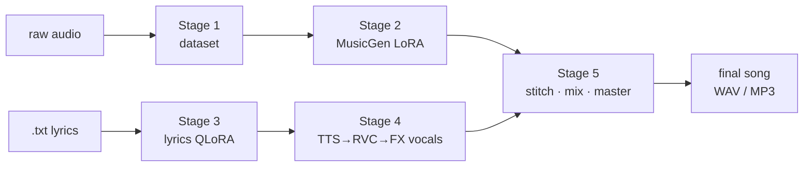

# 🤘 Metalcore AI — open-source music & lyrics generation on Kaggle

An end-to-end, **fully open-source** platform for generating original,
metalcore-inspired music and lyrics — designed to train and run on **Kaggle's
free GPUs** (T4 / P100).

The goal is to learn *style* — modern metalcore structure, breakdowns, ambient
sections, rhythm/lead guitar textures, drum grooves, tension & release — **not**
to clone copyrighted songs.

> **Build status.** All five stages are implemented: **(1)** dataset processing,
> **(2)** MusicGen LoRA fine-tuning, **(3)** lyrics QLoRA fine-tuning,
> **(4)** vocals (Demucs isolation + RVC voice conversion + FX scream chain, with
> multi-vocalist blending), and **(5)** song assembly (section stitching + mix +
> master + WAV/MP3). Self-contained DSP is unit-tested locally; GPU-only stages
> (2–4 training/inference) are verified on Kaggle via the notebooks.

---

## Pipeline at a glance



Each stage reads the previous stage's files from disk, so any stage can be run,
re-run, or resumed independently — the property that lets training survive
Kaggle's session timeouts. For the full module map and data flow see
[`docs/ARCHITECTURE.md`](docs/ARCHITECTURE.md).

---

## Documentation

| Doc | For |
|---|---|
| [docs/README.md](docs/README.md) | Documentation index (start here) |
| [docs/ARCHITECTURE.md](docs/ARCHITECTURE.md) | Module map, data flow, where to change things |
| [docs/CONFIG_REFERENCE.md](docs/CONFIG_REFERENCE.md) | Every config key (all 5 stages) |
| [docs/HARDWARE.md](docs/HARDWARE.md) | VRAM estimates, disk budgets, training durations |
| [docs/TROUBLESHOOTING.md](docs/TROUBLESHOOTING.md) | Symptom → fix, per stage |
| [docs/DATASET_GUIDE.md](docs/DATASET_GUIDE.md) · [VOCALS](docs/VOCALS_GUIDE.md) · [ASSEMBLY](docs/ASSEMBLY_GUIDE.md) | Stage how-to guides |
| [docs/VOICE_SAMPLES_TUTORIAL.md](docs/VOICE_SAMPLES_TUTORIAL.md) | How to collect vocal samples (style-by-style) |
| [CONTRIBUTING.md](CONTRIBUTING.md) · [CHANGELOG.md](CHANGELOG.md) | Contributing + history |

---

## Why these models? (open-source selection)

### Music — **MusicGen (medium)** ✅ chosen

| Model | Quality | Trainability (LoRA) | Kaggle fit | Learns structure |
|---|---|---|---|---|
| **MusicGen (medium)** | High | **Mature** (transformers + PEFT) | ✅ single T4 | ✅ autoregressive |
| MusicGen (small) | Good | Mature | ✅ easy | ✅ |
| Stable Audio Open | Higher fidelity | Immature LoRA tooling | ⚠️ heavier | ⚠️ diffusion |
| AudioCraft (solver) | High | Powerful but heavy/brittle | ⚠️ finicky | ✅ |

**Choice: `facebook/musicgen-medium` fine-tuned with LoRA via `transformers` +
`peft`.** It offers the best balance of quality, mature LoRA support, and a
single-T4 memory footprint, and — being autoregressive — it learns song
*structure* (breakdowns, transitions) better than a diffusion model. We use the
`transformers` training path rather than the AudioCraft solver because it is
leaner and more reliable on Kaggle. Trade-off: MusicGen is **mono, 32 kHz, ~30 s**
coherent — full songs are built by section-stitching (Stage 5).

### Lyrics — **small instruct LLM + QLoRA** ✅

Default `Qwen/Qwen2.5-1.5B-Instruct` (swap to `Llama-3.2-3B-Instruct`), fine-tuned
in **4-bit QLoRA** with `peft` + `trl`. Fits a T4 in ~6–9 GB and trains in
minutes on small corpora.

Full VRAM/duration tables: [`docs/HARDWARE.md`](docs/HARDWARE.md).

---

## Repository layout

```
metalcore/         Shared infra: logging, config, Kaggle paths, audio I/O
dataset_tools/     Stage 1 — validate / preprocess / caption / split (CPU)
music_training/    Stage 2 — MusicGen LoRA train + generate (GPU)
lyric_training/    Stage 3 — lyrics QLoRA build / train / generate (GPU)
rvc_training/      Stage 4 — vocals: isolate / prepare / RVC / TTS / FX (GPU)
inference/         Stage 5 — song assembly: sections / mix / master (CPU)
configs/           YAML configs for each stage
notebooks/         Kaggle-ready notebooks (01 dataset … 05 assembly)
docs/              Architecture, config reference, hardware, troubleshooting, guides
scripts/           smoke_test.sh + smoke_test_dsp.py (no GPU/data needed)
configs/           YAML config per stage (see docs/CONFIG_REFERENCE.md)
outputs/           Generated artefacts (git-ignored)
Makefile           CPU verification targets (make check)
```

---

## Quickstart

### 0. Clone & (optionally) install the package

```bash
git clone <your-fork-url> metalcore && cd metalcore
pip install -e .            # makes metalcore/ + stage packages importable
```

On Kaggle you can skip `pip install -e .` and instead add the repo folder to
`sys.path` (the notebooks do this for you).

### 1. Verify the pipeline locally (no GPU, no data)

```bash
pip install -r requirements-dataset.txt
bash scripts/smoke_test.sh      # synthesises audio, runs Stage 1 end-to-end
```

### 2. Stage 1 — build a dataset

```bash
pip install -r requirements-dataset.txt
python -m dataset_tools.cli all \
    --config configs/dataset.yaml \
    --input  data/raw \
    --output data/dataset
# -> data/dataset/{chunks/, metadata.jsonl, train.jsonl, val.jsonl}
```

### 3. Stage 2 — fine-tune MusicGen (GPU / Kaggle)

```bash
pip install -r requirements-music.txt
python -m music_training.cli train \
    --config configs/music_lora.yaml \
    --dataset data/dataset \
    --output  outputs/music --resume

python -m music_training.cli generate \
    --config configs/music_lora.yaml \
    --adapter outputs/music/checkpoints/step_002000/adapter \
    --prompt "melodic metalcore chorus, soaring lead guitar, double bass" \
    --seconds 12 --num 2 --output outputs/music/generated
```

### 4. Stage 3 — fine-tune lyrics (GPU / Kaggle)

```bash
pip install -r requirements-lyrics.txt
python -m lyric_training.cli build    --lyrics data/lyrics --output data/lyrics_dataset
python -m lyric_training.cli train    --data data/lyrics_dataset --output outputs/lyrics --resume
python -m lyric_training.cli generate --adapter outputs/lyrics/adapter \
    --themes "addiction, hope" --output outputs/lyrics/song.txt
```

### 5. Stage 4 — vocals (GPU / Kaggle)

```bash
pip install -r requirements-vocals.txt
python -m rvc_training.cli setup                         # clone RVC-Project + weights
python -m rvc_training.cli prepare --input data/vocals_raw --output data/rvc_dataset
python -m rvc_training.cli train   --dataset data/rvc_dataset/merged --name blend
python -m rvc_training.cli vocal   --lyrics outputs/lyrics/song.txt \
    --model .../logs/blend/blend.pth --index .../logs/blend/added_*.index \
    --output outputs/vocals/song_vocal.wav
# FX-only re-skin of any WAV (no RVC):
python -m rvc_training.cli fx --input in.wav --output out.wav --style scream
```

See [`docs/VOCALS_GUIDE.md`](docs/VOCALS_GUIDE.md) (blending, RVC setup, the
scream ceiling, legal note).

### 6. Stage 5 — assemble a full song (CPU + optional GPU for generation)

```bash
pip install -r requirements-assembly.txt   # + ffmpeg for MP3
python -m inference.cli song \
    --music-config configs/music_lora.yaml \
    --adapter outputs/music/checkpoints/step_002000/adapter \
    --vocal   outputs/vocals/song_vocal.wav \
    --output  outputs/songs/track01
```

See [`docs/ASSEMBLY_GUIDE.md`](docs/ASSEMBLY_GUIDE.md).

For how to collect and lay out audio/lyric data (legally) see
[`docs/DATASET_GUIDE.md`](docs/DATASET_GUIDE.md); the [notebooks](notebooks/)
(01→05) give the exact Kaggle workflow.

---

## Kaggle workflow (summary)

1. Upload your raw audio (and lyric `.txt` files) as **Kaggle Datasets**
   (read-only under `/kaggle/input`).
2. Run **`notebooks/01_dataset_kaggle.ipynb`** → writes a processed dataset to
   `/kaggle/working`.
3. Run **`02_music_lora_kaggle.ipynb`** and **`03_lyrics_lora_kaggle.ipynb`** to
   fine-tune. Both checkpoint to `/kaggle/working` and support `--resume` across
   the 9–12 h session limit.
4. Run **`04_rvc_kaggle.ipynb`** (vocals) and **`05_assembly_kaggle.ipynb`**
   (final song) to produce the finished track.

Everything is engineered for Kaggle limits: **fp16/4-bit**, gradient
checkpointing, on-signal + periodic checkpointing, resume, and on-disk caches.

---

## Honest limitations

- **Not a song-cloner.** By design it learns style; do not use it to reproduce
  copyrighted tracks. Use licensed/original data (see the dataset guide).
- **MusicGen is mono/32 kHz, ~30 s coherent.** Full songs require section
  stitching (Stage 5, next pass).
- **Screamed vocals are hard.** The planned TTS→RVC + FX chain (Stage 4) has a
  real quality ceiling for authentic screams/fries; it is documented, not hidden.
- **Legal landscape varies.** Training on copyrighted audio and cloning real
  voices carry jurisdiction-dependent risk. Intended for personal/research use.

## Engineering notes

- Type hints, logging, error handling and CLIs throughout.
- Heavy GPU imports are lazy so `--help` and Stage 1 run on CPU-only machines.
- Pinned dependency sets per stage (`requirements-*.txt`) avoid version clashes;
  `torch` is intentionally unpinned to use Kaggle's CUDA build.

## License

MIT (code). You are responsible for the licensing of any data you train on.
