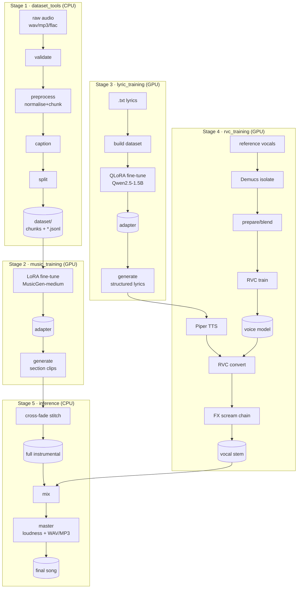

# Architecture — how the code fits together

This document is the map from the *concept* (a 5-stage generation pipeline) to
the *code* (the Python modules that implement it). Read it when you want to
understand, extend, or debug the internals. For usage, see the stage guides
linked from [`docs/README.md`](README.md).

---

## 1. Bird's-eye view



Every arrow that crosses a stage boundary is a **file on disk** (audio or JSONL),
never an in-memory hand-off. That is deliberate: each stage is independently
runnable and resumable, which is what makes the pipeline survive Kaggle's
session timeouts.

---

## 2. Shared infrastructure — `metalcore/`

The one package every stage imports. Keep cross-cutting concerns here so the
stage packages stay focused.

| Module | Responsibility |
|---|---|
| `metalcore/config.py` | `load_config(path, DataclassType)` — reads a YAML file and constructs a typed dataclass, ignoring unknown keys. Every stage config subclasses off this pattern. |
| `metalcore/logging_utils.py` | `get_logger(name, logfile)` — configured logger that writes to both console and a per-stage rotating log file. All stages log through this. |
| `metalcore/paths.py` | Kaggle-aware path helpers (`/kaggle/input` read-only, `/kaggle/working` writable) and small filesystem utilities. |
| `metalcore/audio_io.py` | `load_audio()` / `save_audio()` — the single audio I/O choke point (librosa/soundfile), returning `(np.ndarray, sample_rate)` with consistent mono/float handling. |

**Design rule:** heavy GPU imports (`torch`, `transformers`, `peft`, `demucs`)
are imported *lazily inside functions*, never at module top level. This is why
`--help` and the entire CPU path work on a 3.5 GB-RAM laptop with no GPU.

---

## 3. Stage 1 — `dataset_tools/` (CPU)

Turns a messy folder of audio into a clean, captioned, split training set.

```
raw/ ──validate──▶ report_validate.json ──preprocess──▶ chunks/*.wav + chunks.jsonl
                                          ──caption────▶ metadata.jsonl
                                          ──split──────▶ train.jsonl / val.jsonl
```

| Module | What it does |
|---|---|
| `config.py` | `DatasetConfig` dataclass — mirrors `configs/dataset.yaml`. |
| `validate.py` | `run_validate()` — rejects corrupt / too-short / silent files; optionally copies rejects to `quarantine/`. Emits `report_validate.json`. |
| `preprocess.py` | `run_preprocess()` — loudness-normalises (pyloudnorm, ITU-R BS.1770), resamples to 32 kHz, splits into fixed-length chunks (zero-padded tail). Writes `chunks.jsonl`. |
| `captions.py` | `run_captions()` — extracts tempo/key (librosa) and prepends `style_tags`; produces the text prompt per chunk in `metadata.jsonl`. |
| `split.py` | `run_split()` — **groups by source track** before splitting so no chunk from a track leaks across the train/val boundary. |
| `metadata.py` | `ChunkRecord` dataclass + `read_jsonl`/`write_jsonl` helpers shared by the steps. |
| `cli.py` | `validate` / `preprocess` / `caption` / `split` / `all` subcommands. |

Each step reads the previous step's on-disk artefact, so you can re-run any step
in isolation. `all` chains them in-process.

---

## 4. Stage 2 — `music_training/` (GPU)

LoRA fine-tune of `facebook/musicgen-medium` via `transformers` + `peft`.

| Module | What it does |
|---|---|
| `config.py` | `MusicLoRAConfig` — mirrors `configs/music_lora.yaml`. |
| `model.py` | Builds the MusicGen model + processor, attaches the LoRA adapter to the decoder attention projections, enables gradient checkpointing. |
| `dataset.py` | Loads chunks from `train.jsonl`, caches EnCodec audio codes to disk (one-time cost), yields `(input_ids, labels)` batches. |
| `train.py` | The training loop: fp16 AMP, grad accumulation, classifier-free guidance dropout, periodic + latest checkpointing, `--resume` (restores adapter + optimizer + scheduler + step), and validation generation. |
| `generate.py` | Loads base model + adapter, generates N clips from a prompt at a given length / guidance scale. |
| `cli.py` | `train` / `generate`. |

**Why the `transformers` path (not AudioCraft):** it is leaner and more reliable
on Kaggle, and relies on `transformers==4.44.2` computing the training loss from
`labels`. That version pin is load-bearing — see the troubleshooting note on
`outputs.loss is None`.

**Key constraint:** MusicGen is coherent to ~30 s, mono, 32 kHz. Full songs are
built by generating *sections* and stitching them (Stage 5).

---

## 5. Stage 3 — `lyric_training/` (GPU)

4-bit QLoRA fine-tune of a small instruct LLM (`Qwen2.5-1.5B-Instruct`).

| Module | What it does |
|---|---|
| `config.py` | `LyricsLoRAConfig` — mirrors `configs/lyrics_lora.yaml` (themes, section list, LoRA + bnb settings). |
| `dataset.py` | `build_dataset()` — parses `.txt` lyric files (optional `#theme:` front-matter, else keyword-inferred), formats them into instruct chat-template examples, writes `lyrics_train.jsonl`. |
| `train.py` | `trl` SFT training in 4-bit (bitsandbytes nf4), auto-fallback bf16→fp16 on T4, checkpoint + resume. |
| `generate.py` | Prompts the model with the target theme + explicit section list (`Verse/Chorus/.../Final Chorus`) and returns structured lyrics. |
| `cli.py` | `build` / `train` / `generate`. |

---

## 6. Stage 4 — `rvc_training/` (GPU)

Lyrics → a metalcore vocal stem. Integrates the external, MIT-licensed
`RVC-Project` via subprocess wrappers (it is not a pip dependency).

```
reference mixes ─isolate(Demucs)─▶ vocals ─prepare─▶ merged dataset ─train─▶ voice.pth+.index
lyrics ─TTS(Piper)─▶ spoken wav ─RVC convert─▶ timbre-swapped wav ─FX─▶ vocal stem
```

| Module | What it does |
|---|---|
| `config.py` | `RVCConfig` — mirrors `configs/rvc.yaml`. |
| `isolate.py` | `isolate_dir()` — Demucs 4-stem separation, keeps the `vocals` stem. |
| `dataset.py` | `prepare_dataset()` — silence-splits, filters near-silent/too-short clips, caps minutes per speaker, and (in `merged` mode) pools all vocalists into **one** dataset for a single blended voice. |
| `rvc.py` | `setup()` (clone repo + download hubert/rmvpe/pretrained weights) and pure-function command builders that shell out to RVC-Project's canonical `infer/modules/train/*` + `tools/infer_cli.py`. Fork-adjustable. |
| `tts.py` | `synthesize()` — Piper TTS (spoken-cadence base voice). |
| `fx.py` | Self-contained numpy/scipy FX chain — `clean`/`harsh`/`scream` via waveshaping, noisy-AM roughness, bitcrush, band presence, phase-safe shelving. **No model.** |
| `pipeline.py` | `generate_vocal()` — the full lyrics→TTS→RVC→FX chain. |
| `cli.py` | `setup` / `isolate` / `prepare` / `train` / `infer` / `tts` / `fx` / `vocal`. |

**The scream ceiling** (documented, not hidden): RVC is pitch-based *conversion*
and Piper is spoken-cadence, so true fry/false-cord screams are approximated by
the FX chain, not synthesised. See [`VOCALS_GUIDE.md`](VOCALS_GUIDE.md).

---

## 7. Stage 5 — `inference/` (CPU)

Assembles section clips + a vocal stem into a mastered track.

| Module | What it does |
|---|---|
| `config.py` | `AssemblyConfig` — mirrors `configs/assembly.yaml` (section list, crossfade, mix/master knobs). |
| `sections.py` | Equal-power cross-fade stitching of section clips into one instrumental. |
| `mix.py` | Stereo-widen the instrumental (Haas), centre the vocal, fit vocal length to instrumental, soft bus-limit. |
| `master.py` | Upsample to 44.1 kHz, loudness-normalise to `target_lufs` (pyloudnorm), peak-limit to −0.1 dBFS, export WAV + optional MP3 (pydub/ffmpeg; degrades to WAV if ffmpeg absent). |
| `assemble.py` | `song()` orchestrator — optionally generates each section via Stage 2, stitches, mixes the vocal, masters. |
| `cli.py` | `song` / `stitch` / `mix` / `master`. |

---

## 8. Cross-cutting conventions

- **Config → dataclass.** Every `configs/*.yaml` maps 1:1 to a
  `*/config.py` dataclass loaded via `metalcore.config.load_config`. Add a key in
  both places. Full key reference: [`CONFIG_REFERENCE.md`](CONFIG_REFERENCE.md).
- **Everything is resumable.** GPU stages checkpoint to `outputs/<stage>/` and
  restore on `--resume`. A `latest.txt` pointer records the newest checkpoint.
- **CPU-first import hygiene.** Torch et al. are imported inside functions.
- **JSONL artefacts** between steps: `chunks.jsonl`, `metadata.jsonl`,
  `train.jsonl`, `val.jsonl`, `lyrics_train.jsonl`.
- **Notebooks are thin.** `notebooks/01…05` add the repo to `sys.path`, install
  the stage's `requirements-*.txt`, and call the same CLIs documented here.

---

## 9. Where to make common changes

| I want to… | Edit |
|---|---|
| Change the training sound/style | `configs/dataset.yaml::style_tags`, `configs/music_lora.yaml` |
| Change the song arrangement | `configs/assembly.yaml::sections` |
| Add a lyric theme | `configs/lyrics_lora.yaml::themes` + tag your `.txt` files |
| Swap the base music/lyrics model | `model_id` in the respective config |
| Adapt to an RVC fork with a different CLI | the `*_cmd` builders in `rvc_training/rvc.py` |
| Tune loudness / MP3 export | `configs/assembly.yaml` (`target_lufs`, `export_mp3`) |
| Fit a tighter GPU | see [`HARDWARE.md`](HARDWARE.md) + [`TROUBLESHOOTING.md`](TROUBLESHOOTING.md) |
